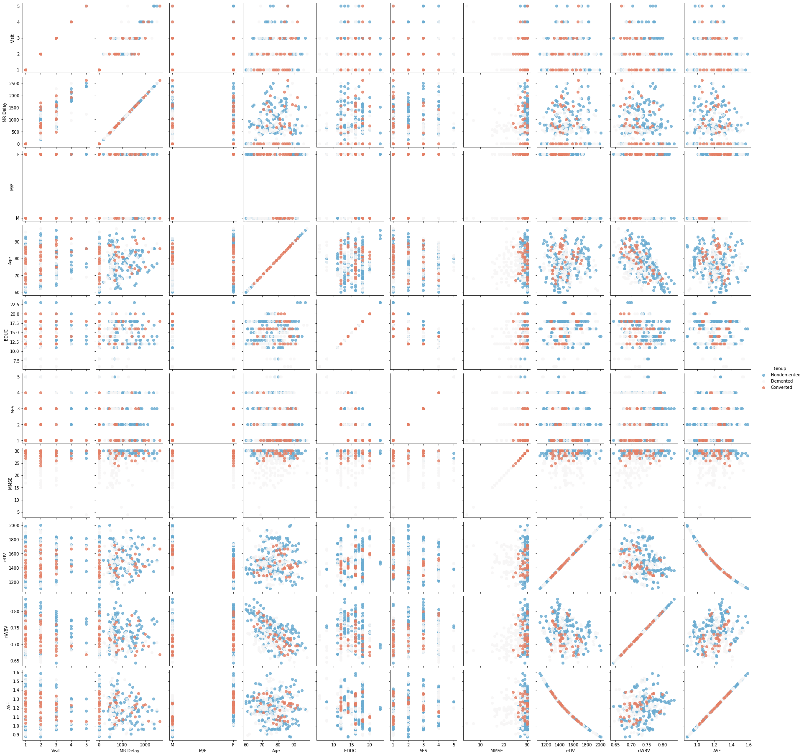
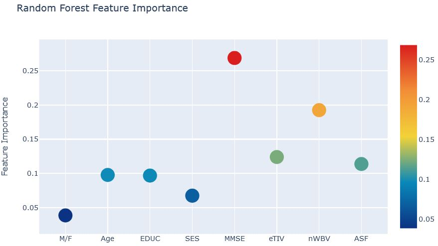
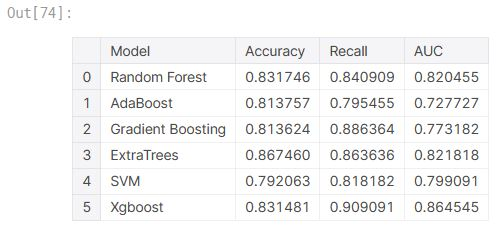

# Detection of Early Onset Alzheimer' Disease using Classifiers
## MRI Comparisons of Demented &amp; Non-Demented Patients

**Author** : SHAILESH DHAMA

Alzheimers Disease also called as Senile Dementia is a progressive disease that destroys memory and other important mental functions. It causes brain cells to degenerate and die. There'll be continuous decline in thinking, behavioral and social skills that disrupts a person's ability to function independently.The early signs of the disease may be forgetting recent events or conversations. As the disease progresses, a person with Alzheimer's disease will develop severe memory impairment and lose the ability to carry out everyday tasks.

##### SYMPTOMS:

At first, a person with Alzheimer's disease may be aware of having difficulty with remembering things and organizing thoughts. A family member or friend may be more likely to notice how the symptoms worsen. People with Alzheimer's may:

    Repeat statements and questions over and over
    Forget conversations, appointments or events, and not remember them later
    Routinely misplace possessions, often putting them in illogical locations
    Get lost in familiar places
    Eventually forget the names of family members and everyday objects
    
### Dataset:

    We will be using the longitudinal MRI data.
    The dataset consists of a longitudinal MRI data of 150 subjects aged 60 to 96.
    Each subject was scanned at least once.
    Everyone is right-handed.
    72 of the subjects were grouped as 'Nondemented' throughout the study.
    64 of the subjects were grouped as 'Demented' at the time of their initial visits and remained so throughout the study.
    14 subjects were grouped as 'Nondemented' at the time of their initial visit and were subsequently characterized as 'Demented'.
    
## Methods:

    ### 1.Analytic Approach :

        Onset-Alzheimer should be bought under 2 classes: Demented and Non-demented

    ### 2.Data Requirements :

        Structured Data containing Gender,Class,Age,EDUC Metric and MMSE Metric.

    ### 3.Data Collection :

        Database from https://www.nia.nih.gov and other Research Centers based on Gero-Science.

    ### 4.Data Understanding and Preparation:

        Choosing Target Variables and eliminating Outliers in Data Cleaning Method.

    ### 5. Modelling and Evaluation:

        Classification models are implemented, resulting in the best accuracy by Adaboost and Random Forest models.
        
## RESULTS :

#### Correlation Matrix


#### Feature Importance-Random Forest


#### Feature Importance-Extra Trees


#### Feature Importance-AdaBoost


#### Feature Importance-Gradient Boosting


#### Feature Importance-Xgboost


#### Feature Importance-Mean_BarPlots


#### Accuracy of Models


### For further information
Please review the narrative of our analysis in [our jupyter notebook](./alzheimer-detection-and-classification.ipynb)

For any additional questions, please contact **shaileshettyd@gmail.com)

##### Repository Structure:

Here is where you would describe the structure of your repoistory and its contents, for exampe:

```

├── README.md                                               <- The top-level README for reviewers of this project.
├── alzheimer-detection-and-classification.ipynb            <- narrative documentation of analysis in jupyter notebook
├── oasis_cross-sectional.csv & oasis_longitudinal.csv      <- datasets
└── images                                                  <- both sourced externally and generated from code

```
## Citing

```
@misc{Shailesh:2019,
  Author = {Shailesh Dhama},
  Title = {Detection of Early Onset Alzheimer' Disease using Classifiers},
  Year = {2019},
  Publisher = {GitHub},
  Journal = {GitHub repository},
  Howpublished = {\url{https://github.com/ShaileshDhama/Alzheimer-Detection-and-Classification}}
}
```
